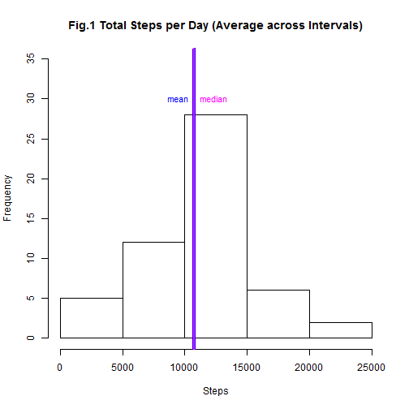
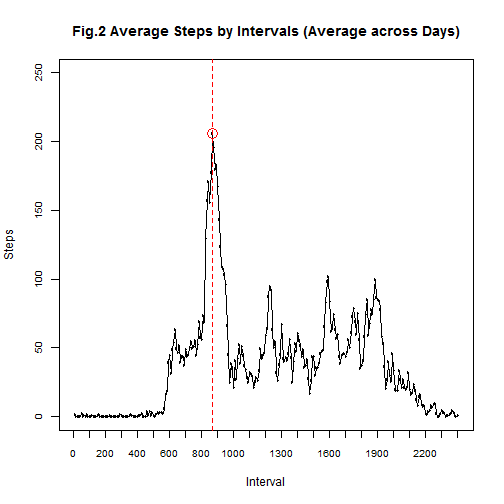
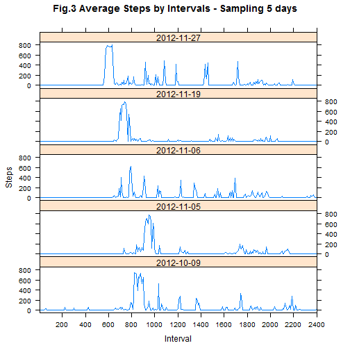
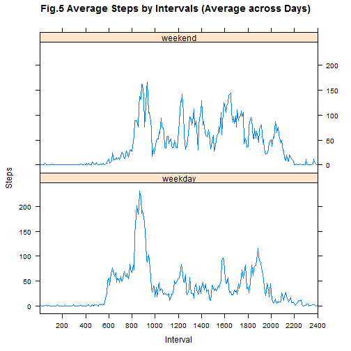

## Part1. Loading and preprocessing the data


```r
url<- "https://d396qusza40orc.cloudfront.net/repdata%2Fdata%2Factivity.zip"
zip<- "activity.zip"
fid<- "activity.csv"

if (!file.exists(fid)) {
    if (!file.exists(zip)) { download.file(url,destfile=zip) }
    unzip(zip) }

activity<- read.csv(fid)
# set variable "date" as Date format and "interval" as factors
activity<- transform(activity, date=as.Date(date,"%Y-%m-%d"),interval=factor(interval))
```


```r
library(lattice)
```

## Part.2 What is mean total number of steps taken per day?

**1. Here's a histgram showing total number of steps taken each day(dates with missing values are ignored) :**

```r
dailySum<- aggregate(steps ~ date, data=activity, sum) #NAs(missing data) are ignored
with(dailySum, {hist(steps, main="Fig.1 Total Steps per Day (Average across Intervals)", 
                     xlab="Steps", ylim=c(0,35))
             abline(v=mean(steps), col="blue", lwd=4)
             abline(v=median(steps), col="magenta", lwd=2)
             text(mean(steps), 30, "mean", col="blue", pos=2, cex=0.9)
             text(median(steps), 30, "median", col="magenta", pos=4, cex=0.9)
             })
```

 

**2. Mean and median of steps taken per day :**

```r
summary(dailySum$steps)
```

```
##    Min. 1st Qu.  Median    Mean 3rd Qu.    Max. 
##      41    8841   10760   10770   13290   21190
```


## Part.3 What is the average daily activity pattern?

**1. Here's a time series plot of the 5-minute interval (x-axis) and the average number of steps taken, averaged across all days (y-axis) :**

```r
intAvg<- aggregate(steps ~ interval, data=activity, mean) #NAs(missing data) are ignored

# "interval" is a factor variable and each one represents a time stamp(ex. interval 800= time stamp 8:00). 
with(intAvg, {plot(interval, steps, main="Fig.2 Average Steps by Intervals (Average across Days)", 
                      xlab="Interval", ylab="Steps", ylim=c(0,250), cex.axis=0.8, xaxt="n")
                 lines(interval, steps)
                 axis(1,at=seq.int(0,288,by=12), labels=seq.int(0,100*24,by=100), cex.axis=0.8)
                 points(interval[which.max(steps)],steps[which.max(steps)],col="red",cex=2)
                 abline(v=interval[which.max(steps)],col="red",lty=2)
                 })
```

 

**2. The maximum steps taken in a 5-minute interval :**

```r
max<- max(intAvg$steps)
imax<- intAvg$interval[which.max(intAvg$steps)]
```

The maximum steps per interval, on average, occurs in interval **835** with **206.17** steps.


## Part.4 Imputing missing values

**1. Look at the total number of missing values in the dataset and where they are :**

```r
# number of missing values in the dataset
sum(is.na(activity$steps))
```

```
## [1] 2304
```

```r
# percentage of data with missing values
mean(is.na(activity$steps)) 
```

```
## [1] 0.1311475
```

```r
# dates with missing values and how many it contains
with(subset(activity,is.na(steps)), {table(date)}) 
```

```
## date
## 2012-10-01 2012-10-08 2012-11-01 2012-11-04 2012-11-09 2012-11-10 
##        288        288        288        288        288        288 
## 2012-11-14 2012-11-30 
##        288        288
```

The missing values are from 8 complete days(288 NAs each day), ie. there are 8 days that have no data. Using the mean for each 5-minute interval to fill in the missing data could be a good strategy

**2. First, sample 5 days(10% of the days without missing values) and look at their trend by intervals :**

```r
set.seed(1234)
sample<-with(subset(activity,!is.na(steps)), {
    sample(unique(date),floor(length(unique(date))/10)) })
mini<-subset(activity, date %in% sample)
xyplot(steps ~ interval | date, data=mini, layout=c(1,5), type="l", 
      main="Fig.3 Average Steps by Intervals - Sampling 5 days",xlab="Interval",ylab="Steps", 
      scales=list(x=list(at=seq.int(0,288,by=24),labels=seq.int(0,2400,by=200), cex=0.8, tick.number=2)))
```

 

The patterns by intervals of these 5 days are similar to one another as well as to Fig.2 above: a clear spike in the morning before 10:00, and a smaller spike in the evening between 17:00 and 18:00. 

I choose to fill the missing data with the mean of each 5-minute interval.


**3. Create a new dataset that is equal to the original dataset but with the missing data filled in :**

Strategy: fill in the missing values with the mean for each 5-minute interval

```r
na<-which(is.na(activity$steps)) 

#since the missing values are from 8 complete days(288 NAs each day), we can repeat the steps from "intAvg" dataset(the calculated mean of each interval) 8 times to replace the NAs.
activity2<- activity
activity2$steps[na]<- rep(intAvg$steps,8)
```

**4. Histgram of total number of steps taken each day :**

The graph shows data **AFTER** missing values were imputed.


```r
dailySum2<- aggregate(steps ~ date, data=activity2, sum)

with(dailySum2, {hist(steps, main="Fig.4 Total Steps per Day (Average across Intervals)\n-missing values imputed with the mean of each 5-minute interval-", xlab="Steps", ylim=c(0,35), cex.axis=0.8)
             abline(v=mean(steps), col="blue", lwd=6)
             abline(v=median(steps), col="magenta", lwd=3)
             text(mean(steps), 30, "mean", col="blue", pos=2, cex=0.9)
             text(median(steps), 30, "median", col="magenta", pos=4, cex=0.9)
             })
```

 

**5. Mean and median of steps taken per day with missing values imputed :**

```r
summary(dailySum2$steps)
```

```
##    Min. 1st Qu.  Median    Mean 3rd Qu.    Max. 
##      41    9819   10770   10770   12810   21190
```

**6. Obeservation on impact of imputing missing values**

For this data set, after imputing missing values with an appropriate strategy, the distribution looks very similar to Fig.1(simply omitting dates with missing values). The median moves up slightly while the mean stays the same. Higher frequency of the bin in which the mean falls(10000-15000 steps) is observed since all the previously-omitted dates are now included in this bin.


## Part5. Are there differences in activity patterns between weekdays and weekends?

**1. Split dataset into "weekday" and "weekend" categories :**

```r
activity2<- transform(activity2,weekday=factor(weekdays(date)))
levels(activity2$weekday)[levels(activity2$weekday)!="Saturday" & levels(activity2$weekday)!="Sunday"]<-"weekday"
levels(activity2$weekday)[levels(activity2$weekday)=="Saturday" | levels(activity2$weekday)=="Sunday"]<-"weekend"
```

**2. Here's a panel plot comparing the average number of steps taken per 5-minute interval across weekdays and weekends :**

```r
wd<- with(subset(activity2,weekday=="weekday"), 
    data.frame(interval=unique(interval),steps=sapply(split(steps,interval),mean,na.rm=T),weekday="weekday"))
we<- with(subset(activity2,weekday=="weekend"), 
    data.frame(interval=unique(interval),steps=sapply(split(steps,interval),mean,na.rm=T),weekday="weekend"))
mrg<- rbind(wd,we)
xyplot(steps ~ interval | weekday, data=mrg, layout=c(1,2), type="l", 
      main="Fig.5 Average Steps by Intervals (Average across Days)",xlab="Interval",ylab="Steps", 
      scales=list(x=list(at=seq.int(0,288,by=24),labels=seq.int(0,2400,by=200), cex=0.8, tick.number=2)))
```

 


```r
#mean
with(mrg, tapply(steps,weekday,mean))
```

```
##  weekday  weekend 
## 35.61058 42.36640
```

```r
#median
with(mrg, tapply(steps,weekday,median))
```

```
##  weekday  weekend 
## 25.80314 32.33962
```

```r
#max
with(mrg, tapply(steps,weekday,max))
```

```
##  weekday  weekend 
## 230.3782 166.6392
```


**3. Observation**

The plot shows a few differences in activity patterns between weekdays and weekends.

During the weekday, steps are taken earlier in the day(starts between 5:00 and 6:00) and the peak occurs around 8:00-10:00 in the morning. A second and much smaller peak is observed between 10:00-20:00.

Whereas during the weekend, although the maximun also occurs between 8:00-10:00, it is not as clear a spike as in the weekdays. There are several peak intervals. Steps do not increase significantly until around 8:00, and are spread more during the day(more activities).

Average weekend steps(across intervals) are higher than weekday.
